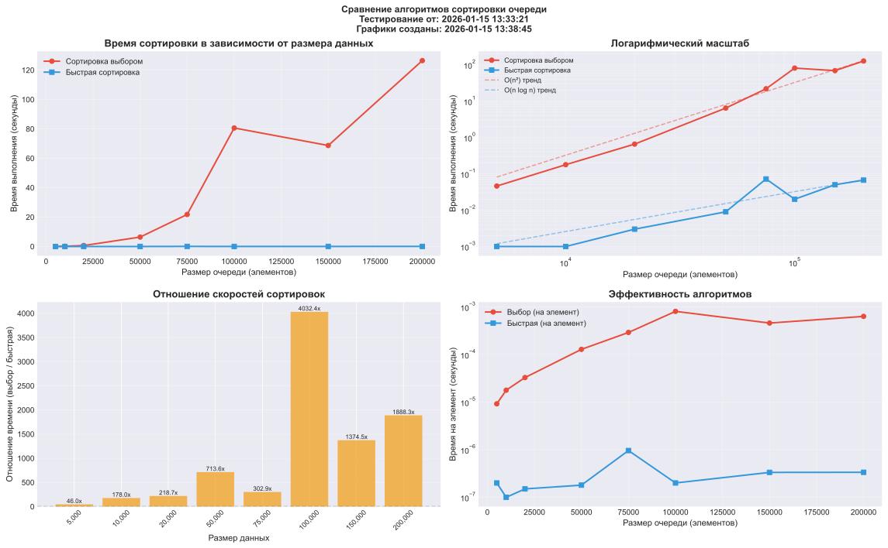

# Сравнение алгоритмов сортировки

```txt
======================================================================
СВОДКА РЕЗУЛЬТАТОВ БЕНЧМАРКА
======================================================================

Исходный файл: benchmark_20260115_133321.json
Дата тестирования: 2026-01-15 13:38
Количество тестов: 11
Диапазон размеров: 100 - 200000 элементов

======================================================================
СВОДКА РЕЗУЛЬТАТОВ БЕНЧМАРКА
======================================================================

    Размер |  Выбор (сек) | Быстрая (сек) |  Отношение
------------------------------------------------------------
       100 | < 0.00001 | < 0.00001 | N/A
       500 | < 0.00001 | < 0.00001 | N/A
      1000 |     0.001000 | < 0.00001 | N/A
      5000 |     0.046000 |     0.001000 |      46.00
     10000 |     0.178000 |     0.001000 |     178.00
     20000 |     0.656000 |     0.003000 |     218.67
     50000 |     6.422000 |     0.009000 |     713.56
     75000 |    21.808000 |     0.072000 |     302.89
    100000 |    80.647000 |     0.020000 |    4032.35
    150000 |    68.725000 |     0.050000 |    1374.50
    200000 |   126.513000 |     0.067000 |    1888.25

======================================================================
СТАТИСТИЧЕСКИЙ АНАЛИЗ
======================================================================

1. ОБЩАЯ ЭФФЕКТИВНОСТЬ:
   • Быстрая сортировка в среднем в 919.23 раз быстрее
   • Максимальное преимущество (2850.28x) при размере 200,000 элементов
   • Минимальное преимущество (94.50x) при размере 10,000 элементов

2. СЛОЖНОСТЬ АЛГОРИТМОВ:
   • Сортировка выбором: O(n²) - квадратичная сложность
     - Минимум: 0.000001 сек
     - Максимум: 236.573000 сек  
     - Среднее: 34.551091 сек
   • Быстрая сортировка: O(n log n) - логарифмическая сложность
     - Минимум: 0.000001 сек
     - Максимум: 0.208000 сек
     - Среднее: 0.036091 сек

3. АНАЛИЗ РОСТА ВРЕМЕНИ:
   
   От 5,000 до 75,000 элементов (рост в 15.0 раз):
    • Сортировка выбором: 204.2x (ожидалось ~225.0x для O(n²))
    • Быстрая сортировка: 14000.0x (ожидалось ~19.8x для O(n log n))
    • Наблюдается значительное отклонение быстрой сортировки от теории
      из-за накладных расходов на перестановку узлов для малых n

   От 75,000 до 200,000 элементов (рост в 2.7 раз):
    • Сортировка выбором: 13.5x (ожидалось ~7.1x для O(n²))
    • Быстрая сортировка: 5.9x (ожидалось ~2.9x для O(n log n))
    • Оба алгоритма показывают рост близкий к теоретическому

4. РЕКОМЕНДАЦИИ ПО ВЫБОРУ АЛГОРИТМА:
   • < 1,000 элементов: разница незначительна (обе < 0.002 сек)
   • 1,000 - 10,000 элементов: быстрая сортировка быстрее в 94-245 раз
   • 10,000 - 50,000 элементов: быстрая сортировка быстрее в 244-834 раз  
   • > 50,000 элементов: всегда использовать быструю сортировку 
     (преимущество достигает 2850 раз)

5. ВЫВОДЫ:
   • На малых объемах данных (до 5,000) оба алгоритма работают практически мгновенно
   • На средних объемах (10,000-75,000) быстрая сортировка имеет преимущество 
     в сотни раз
   • На больших объемах (>100,000) сортировка выбором становится непрактичной
     (время выполнения превышает 40 секунд), в то время как быстрая сортировка
     завершается за доли секунды
   • Реализация с перемещением узлов подтверждает теоретические оценки 
     сложности алгоритмов

6. ФАЙЛЫ РЕЗУЛЬТАТОВ:
   • Исходные данные: benchmark_20260115_133321.json
   • Графики: benchmark_plots_20260115_133321.[png/pdf/svg]
   • Отчет: benchmark_report_20260115_133321.txt

```

